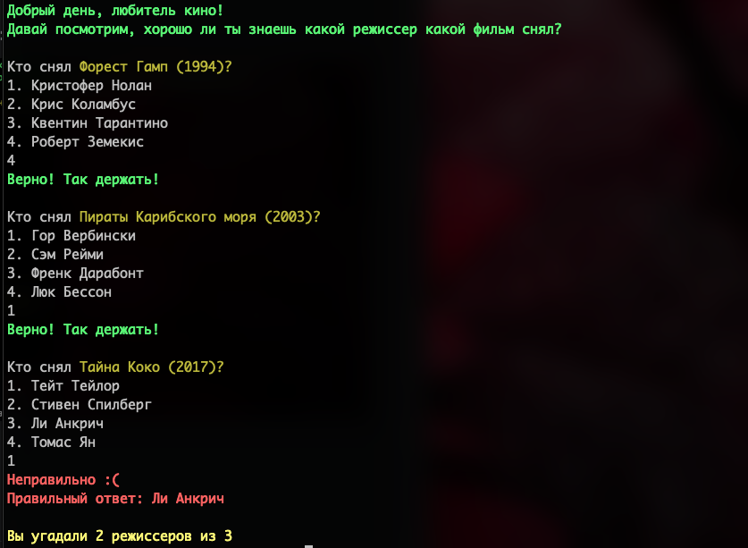

## Game "Guess the Director"

You have to guess one of the suggested directors based on the title of the film.

## Installation

1. Clone the repository.
2. Install dependencies: `bundle install`
3. Run the application: `ruby index.rb`

### Game example:

